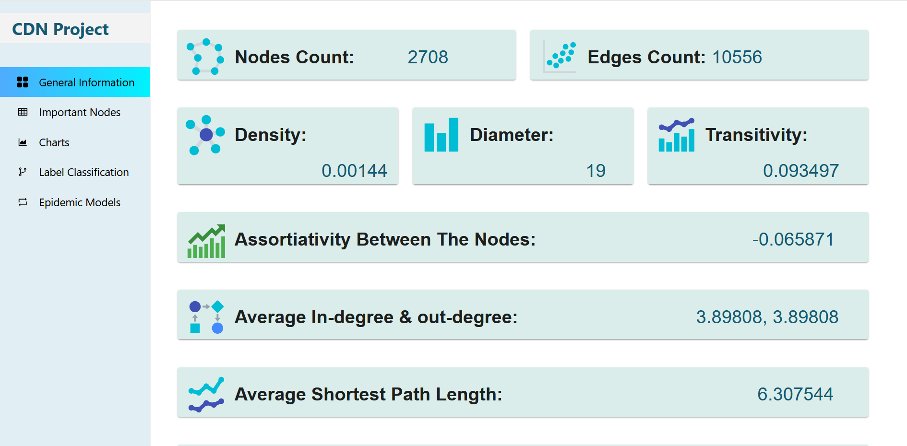
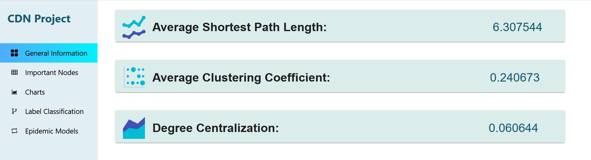
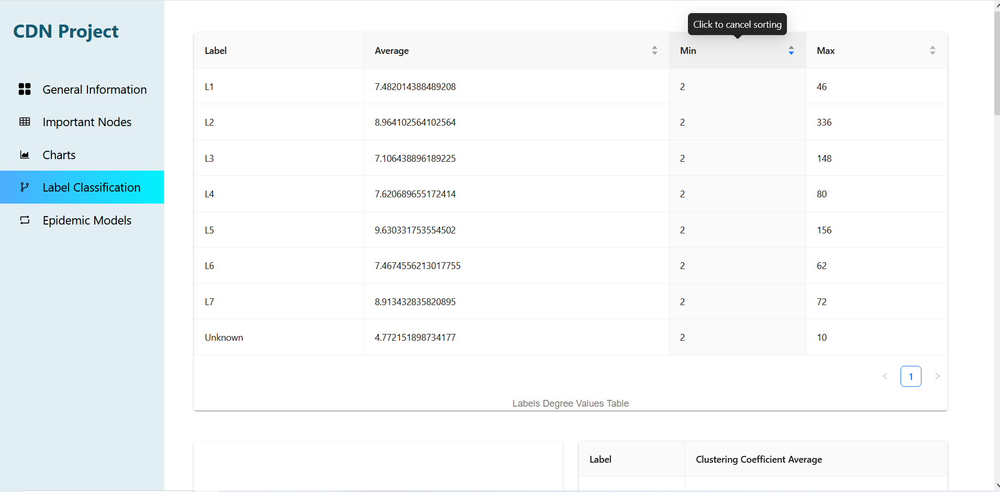
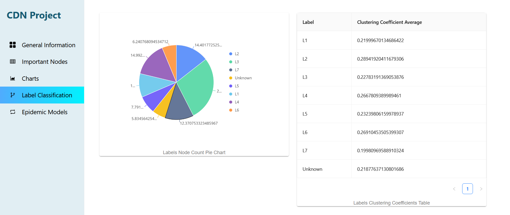
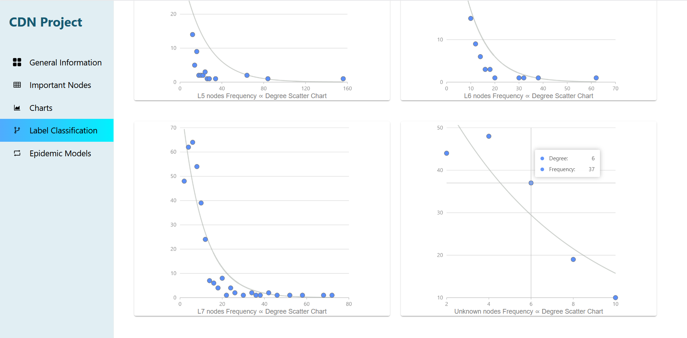
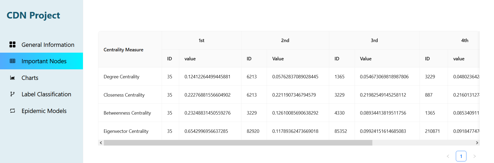
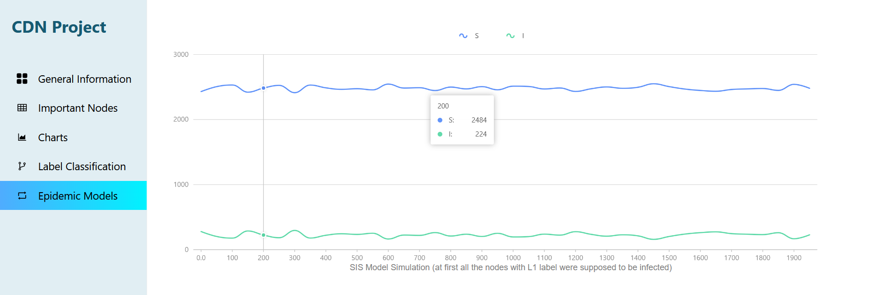
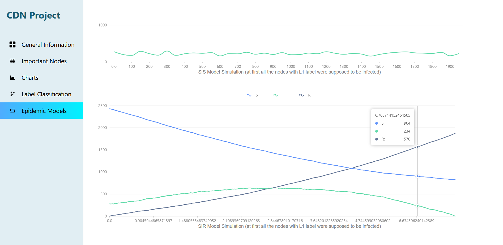

# Network Visualization Frontend Project

## Project Overview
<video src="assets/graph_visualization.mp4" controls width="700"></video>

This repository contains the **frontend part of the final project** developed for the **Complex Dynamic Networks** course.

The **backend project**, **Colab notebook**, and **full project report** can be found in the following repository:

🔗 https://github.com/AylinNaebzadeh/Network-Visualization-Backend-Project/tree/main

This web application provides tools for **network analysis and visualization**. In addition to computing general network statistics, it enables analysis of important nodes and simulation of epidemic spreading models.

### Features

The application calculates and visualizes:

- **General Network Statistics**
  - Diameter
  - Transitivity
  - Number of nodes
  - Number of edges

- **Centrality Measures**
  - Identifies **important nodes** in the network based on different centrality metrics.

- **Clustering Analysis**
  - Computes the **average clustering coefficient** for groups of nodes based on their labels.

- **Epidemic Modeling**
  - Implements two common epidemic models:
    - **SIS (Susceptible–Infected–Susceptible)**
    - **SIR (Susceptible–Infected–Recovered)**

These models allow users to simulate **infection spread dynamics over networks**.

### Application Preview

Below are some screenshots from the application:

---

## Technology Stack

- **ReactJS**

### Important Libraries

- **ApexCharts** – Used for interactive data visualization
- **Material UI** – UI component library
- **Axios** – For API communication with the backend
